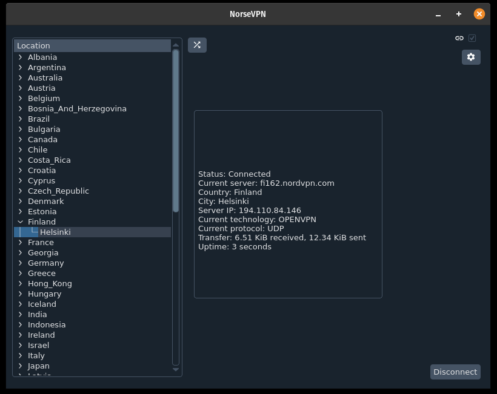

# NorseVPN


A linux NordVPN GUI client

**Disclaimer** \n
The developers do not stand in any relation to [nordVPN](https://nordvpn.com).
Further no code from nordVPN is used, this application is just build on the [cli-client](https://nordvpn.com/de/download/linux/).
## Setup
First you need to install the official client from [nordVPN](https://nordvpn.com/de/download/linux/).
The next step is to login to the client. NorseVPN will not get access to your login information.

```bash
 $ nordvpn login
```

## Usage




### System Tray


### Configuration


## Development

### Coding

### Design

Currently the Material Design Icons from [Google](https://fonts.google.com/icons?selected=Material+Icons) are used.