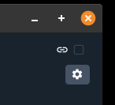

# NorseVPN


A linux NordVPN GUI client

**Disclaimer**
> The developers do not stand in any affiliated relation to [nordVPN](https://nordvpn.com), it is not verified or supported by nordVPN.
> Further no code from nordVPN is used, this application is just wrapped around the [cli-client](https://nordvpn.com/de/download/linux/).

------

## Setup
First you need to install the official client from [nordVPN](https://nordvpn.com/de/download/linux/).
The next step is to login to the client. NorseVPN will not get access to your login information.

```bash
 $ nordvpn login
```

## Usage
If you start the NorseVPN client you will see the main window with all the actions that you will need. On the left there is the selection of the nordVPN server in different countries over the world. These location will get automatically updated if nordVPN adds new servers. In the middle is the live view of the connection. On the top right is the settings button and a checkbox if you are currently connected to a nordVPN server.


The location can be selected by country and city. If you are not connected you can select a city and with a click on the button *Connect* you will get connected. After a startup of the connection further actions are limited a few seconds to avoid crashing the vpn settings on your computer. If you are connected you can change the server by selecting a new city.

The last selected location is stored in a json-file to be able to quick-connect the next application start to the last location.

> **_NOTE:_** 
> If you do note choose a city but only a country the nordvpn client will choose a city for you


A new feature which the cli-client does not have is a random location selection. A click on this button will connect you with a random selected server which are available. This action is independent from the connection state so it will work if you are disconnected or connected.


If you connected to a server the live status window in the center of the window will display further information on your connection. The connected checkbox on the top right corner is now checked.


### System Tray
Beside the main window you can set quick actions with a system tray application. There you can connect and disconnect to a vpn. The last connected vpn server is chosen if you 'quick connect'. The exit action will close the whole NorseVPN application.


### Configuration
By clicking the settings wheel on the top right corner a new window opens with all the settings provided by the nordVPN client.



> **_NOTE:_**
> At this moment no own functions are provided. All this settings are provided by the nordVPN-cli application.


Current available configurations:
- Firewall
- Kill Switch
- [Cyber Security](https://nordvpn.com/features/cybersec/)
- Obfuscate
- Notify
- Auto Connect
- IPv6
- DNS
- Protocol
  - UDP
  - TCP
- Technology
  - OpenVPN
  - [NordLynx](https://nordvpn.com/blog/nordlynx-protocol-wireguard/)

These configuration parameters get stored inside a json-file to store them for the next application start.

> For further information please read more at the [archlinux-wiki](https://wiki.archlinux.org/title/NordVPN#Settings).


If you want to close the window it is asked if you want to save the settings.
> **_NOTE:_**
> The settings are only active by the next connection to a vpn. If you are currently connected please disconnect and reconnect so the settings are used.


------------

## Development

### Coding

### Design

Currently the Material Design Icons from [Google](https://fonts.google.com/icons?selected=Material+Icons) are used.

### Documentation
The code documentation is build with [doxygen](https://www.doxygen.nl/index.html). The setup is different on every operating os but not quite hard to master.
 
 If doxygen is ready you can build the documentation in the console:

 ```bash
make html
```
After the build has finished you can open the documentation in your browser with the file *doc/_output/html/index.html*. This is the root file where you can navigate through the different categories which doxygen generated.

> **_NOTE:_**
> The documentation is ignored from git. So the documentation has to be built everytime it is checkout and there was an update.